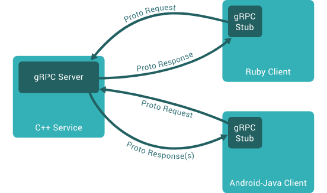

# java版gRPC实战
# 参考 https://github.com/zq2599/blog_demos 

## 关于gRPC
1. gRPC 是一个高性能、开源和通用的 RPC 框架，面向移动和 HTTP/2 设计。目前提供 C、Java 和 Go 语言版本，分别是：grpc, grpc-java, grpc-go. 其中 C 版本支持 C, C++, Node.js, Python, Ruby, Objective-C, PHP 和 C# 支持
   以及gRPC-Web（使 Web 应用程序能够直接与后端 gRPC 服务通信，不需要 HTTP 服务器充当中介）.
2. gRPC 基于 HTTP/2 标准设计，带来诸如双向流、流控、头部压缩、单 TCP 连接上的多复用请求等特。这些特性使得其在移动设备上表现更好，更省电和节省空间占用。
3. 各个进程之间可以通过gRPC相互调用，如下图：

   
## 核心技术
1. 为了用java发布gRPC服务，使用的是开源库`net.devh:grpc-server-spring-boot-starter` 
2. 在调用其他gRPC服务时用的是`net.devh:grpc-client-spring-boot-starter`
3. 感谢该开源库的作者Michael大神，您的智慧的简化了java程序员的gRPC开发工作，[项目地址](https://github.com/yidongnan/grpc-spring-boot-starter)
## 概览
   第一步要做的：

1. 明确依赖库和开发环境
2. 新建父工程`springboot-grpc`，今后《java版gRPC实战》系列的所有源码都在这个工程中
3. 实战用`proto`文件自动生成java代码
## 依赖库和开发环境
   整个系列文章涉及的依赖库和开发环境的情况如下：

1. 🚗JDK：11.0.10
2. 👷gradle：6.8.0
3. 📎springboot：2.3.8.RELEASE
4. 🔍grpc：1.39.0
5. 🔗protobuf：3.17.3
6. 🔍grpc-server-spring-boot-starter：2.11.0.RELEASE
7. 🔎grpc-client-spring-boot-starter：2.11.0.RELEASE
8. 💻: macOS BigSur 11.4 M1 mbp13
9. 🔧IDEA：2021.1.1 (Ultimate Edition)